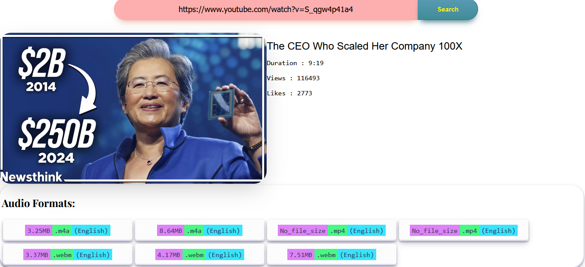
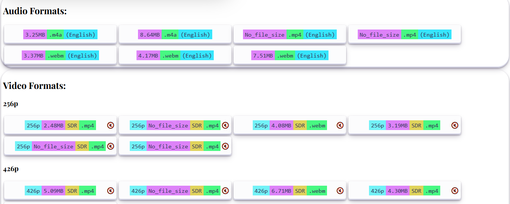
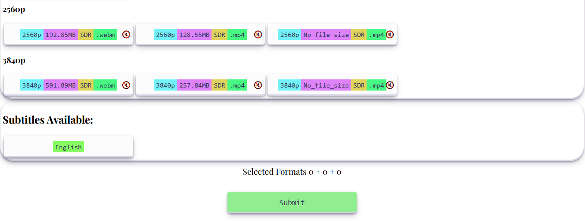

<h1>React Yt-dlp gui</h1>

<h2>Features</h2>
<ul>
  <li>
    Made a tool using React and Node.js that lets you download videos from YouTube in any quality.
  </li>
  <li>
    Added support for downloading audio in different formats, so you can get just the music if you want.
  </li>
  <li>
    Included the ability to download subtitles in many languages, making it easier to understand videos.
  </li>
  <li>
    Used Node.js websockets to show how far along your download is happening in real-time.
  </li>
  <li>
    Expanded the tool to work with other sites like Instagram Shorts and Twitter, using a tool called yt-dlp.
  </li>
  <li>
    Designed the tool to be easy to use on any device, making sure it looks good and works well everywhere.
  </li>
  <li>
    Made sure the tool works quickly and smoothly, no matter what device or screen size you're using.
  </li>
</ul>

<video src="/temp/sample.mp4" width = 1080 />